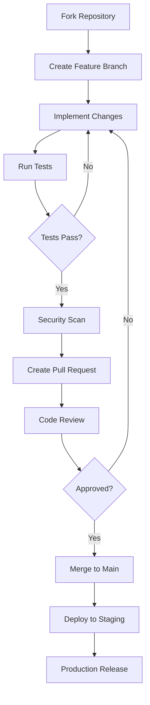

# 🤝 Contributing to Atlas 6-DOF Robot Arm Control System

## 🎯 Welcome Contributors!

Thank you for your interest in contributing to the Atlas 6-DOF Robot Arm Control System! This project represents cutting-edge mechatronic innovation developed at Mechatronic Solution in collaboration with Polytechnique Montréal.

## 🚨 Important Legal Notice

⚠️ **PROPRIETARY SOFTWARE**: This project contains proprietary technology protected by intellectual property rights. Before contributing, you must understand and agree to our licensing terms and confidentiality requirements.

## 📋 Prerequisites

### 🔐 Legal Requirements

1. **Contributor License Agreement (CLA)**
   - All contributors must sign our CLA
   - Download: [CLA Form](https://mechatronic-solution.com/legal/cla.pdf)
   - Submit to: legal@mechatronic-solution.com

2. **Non-Disclosure Agreement (NDA)**
   - Required for access to proprietary components
   - Contact: legal@mechatronic-solution.com

3. **Background Check** (for significant contributors)
   - Industrial security clearance may be required
   - Process initiated after initial contributions

### 🛠️ Technical Prerequisites

```bash
# Required Software Stack
├── Development Environment
│   ├── GCC 11+ (C++17 support)
│   ├── Python 3.11+
│   ├── SWI-Prolog 8.4+
│   ├── GnuCOBOL 3.1+
│   └── Git 2.30+
├── CAD Software (for mechanical contributions)
│   ├── SolidWorks 2024+
│   ├── ANSYS Workbench 2024 R1+
│   └── Altium Designer 23+
├── Hardware (for testing)
│   ├── STM32F407 Development Board
│   ├── CAN Bus Interface
│   └── Oscilloscope (100MHz+)
└── Industrial Knowledge
    ├── ISO 13849 (Safety)
    ├── IEC 61131-3 (PLC Programming)
    └── Robotics Fundamentals
```

## 🎯 Contribution Categories

### 1. 🔧 Core System Development

**Areas:**
- Real-time control algorithms (C++)
- Safety systems and monitoring
- Communication protocols (CAN, Ethernet, MQTT)
- Hardware abstraction layers

**Requirements:**
- Industrial automation experience
- Real-time systems knowledge
- Safety-critical systems understanding
- Signed NDA required

### 2. 🧠 AI and Analytics

**Areas:**
- Digital twin development (Python)
- Predictive maintenance algorithms
- Expert system rules (Prolog)
- KPI analytics (COBOL)

**Requirements:**
- Machine learning expertise
- Industrial IoT experience
- Data science background
- Statistical analysis skills

### 3. 🎨 Mechanical Design

**Areas:**
- CAD model improvements
- Structural optimization
- Manufacturing process enhancement
- Material selection

**Requirements:**
- Mechanical engineering degree
- SolidWorks proficiency
- Manufacturing experience
- FEA analysis skills

### 4. 🔌 Electronics Design

**Areas:**
- PCB layout optimization
- Circuit design improvements
- EMC compliance
- Power management

**Requirements:**
- Electrical engineering background
- Altium Designer experience
- High-speed digital design
- Industrial electronics knowledge

### 5. 📚 Documentation

**Areas:**
- Technical documentation
- User manuals
- Training materials
- API documentation

**Requirements:**
- Technical writing skills
- Industry standards knowledge
- Multi-language capabilities (preferred)

## 🚀 Getting Started

### Step 1: Legal Clearance

```bash
# 1. Contact legal team
echo "Send email to legal@mechatronic-solution.com with:"
echo "- Full name and contact information"
echo "- Intended contribution area"
echo "- Professional background"
echo "- Employer information (if applicable)"

# 2. Wait for legal review (3-5 business days)
# 3. Sign required agreements
# 4. Receive contributor access credentials
```

### Step 2: Development Environment Setup

```bash
# Clone repository (requires access credentials)
git clone https://github.com/MechatronicSolution/atlas-6dof-private.git
cd atlas-6dof-private

# Install dependencies
./scripts/setup/install_dependencies.sh

# Configure development environment
./scripts/setup/configure_dev_env.sh

# Verify setup
./scripts/testing/verify_setup.sh
```

### Step 3: Contribution Workflow



## 📝 Development Guidelines

### 🔒 Security Requirements

```yaml
security_checklist:
  code_review:
    - No hardcoded credentials
    - Input validation implemented
    - Error handling secure
    - Logging doesn't expose sensitive data
    
  testing:
    - Security unit tests included
    - Penetration testing passed
    - Static analysis clean
    - Dependency scan clear
    
  documentation:
    - Security considerations documented
    - Threat model updated
    - Risk assessment completed
```

### 🏭 Industrial Standards Compliance

**Mandatory Standards:**
- **ISO 13849**: Safety of machinery
- **IEC 61508**: Functional safety
- **IEC 62443**: Industrial cybersecurity
- **ISO 9001**: Quality management

**Code Quality Requirements:**
```cpp
// Example: Safety-critical function template
class SafetyCriticalFunction {
private:
    // All safety functions must have dual redundancy
    bool primary_check() const;
    bool secondary_check() const;
    
public:
    // SIL 2 compliant safety function
    SafetyResult execute_safety_function() {
        // Dual redundant safety checks
        bool primary_ok = primary_check();
        bool secondary_ok = secondary_check();
        
        // Fail-safe behavior
        if (!primary_ok || !secondary_ok) {
            trigger_safe_state();
            log_safety_event("Safety function failed");
            return SafetyResult::FAILED;
        }
        
        return SafetyResult::SUCCESS;
    }
};
```

### 📊 Testing Requirements

```bash
# Comprehensive testing pipeline
./scripts/testing/run_unit_tests.sh        # 95%+ coverage required
./scripts/testing/run_integration_tests.sh # All critical paths
./scripts/testing/run_safety_tests.sh      # Safety function validation
./scripts/testing/run_performance_tests.sh # Real-time constraints
./scripts/testing/run_security_tests.sh    # Vulnerability scanning
```

## 🔍 Code Review Process

### Review Criteria

| Aspect | Requirement | Reviewer |
|--------|-------------|----------|
| **Functionality** | Meets requirements | Technical Lead |
| **Safety** | SIL 2 compliant | Safety Engineer |
| **Security** | No vulnerabilities | Security Team |
| **Performance** | Real-time constraints met | Performance Engineer |
| **Quality** | Industrial standards | QA Team |
| **IP Compliance** | No IP violations | Legal Team |

### Review Checklist

```markdown
- [ ] Code follows project style guidelines
- [ ] All tests pass (unit, integration, safety)
- [ ] Documentation updated
- [ ] Security review completed
- [ ] Performance impact assessed
- [ ] Backward compatibility maintained
- [ ] IP clearance obtained
- [ ] Safety analysis updated
```

## 🏆 Recognition and Rewards

### Contribution Levels

| Level | Criteria | Recognition |
|-------|----------|-------------|
| **Bronze** | 5+ merged PRs | Certificate + LinkedIn endorsement |
| **Silver** | 20+ PRs + significant feature | Conference presentation opportunity |
| **Gold** | 50+ PRs + major contribution | Co-authorship on publications |
| **Platinum** | Exceptional contribution | Patent co-invention consideration |

### Academic Benefits

- **Research Collaboration**: Joint research opportunities
- **Publication Rights**: Co-authorship on technical papers
- **Conference Presentations**: Speaking opportunities at industry events
- **Internship Programs**: Paid internship opportunities at Mechatronic Solution

## 🚨 Issue Reporting

### Bug Reports

```yaml
bug_report_template:
  title: "[BUG] Brief description"
  
  environment:
    - OS version
    - Hardware configuration
    - Software versions
    - Network setup
    
  reproduction_steps:
    - Step 1
    - Step 2
    - Expected result
    - Actual result
    
  severity:
    - Critical (safety impact)
    - High (functionality broken)
    - Medium (degraded performance)
    - Low (cosmetic issue)
    
  attachments:
    - Log files
    - Screenshots/videos
    - Configuration files
```

### Security Vulnerabilities

⚠️ **DO NOT** report security issues publicly!

**Process:**
1. Email: security@mechatronic-solution.com
2. Use PGP encryption (key available on website)
3. Include detailed reproduction steps
4. Wait for acknowledgment before disclosure

## 📚 Learning Resources

### Required Reading

1. **Industrial Robotics Handbook** - Siciliano, Khatib
2. **Real-Time Systems** - Liu
3. **Functional Safety Standards** - IEC 61508 series
4. **Industrial Cybersecurity** - IEC 62443 series

### Training Programs

```
Mechatronic Solution Academy:
├── Safety-Critical Systems Design (40h)
├── Industrial Robotics Programming (32h)
├── Real-Time Control Systems (24h)
├── Cybersecurity for Industrial Systems (16h)
└── Project Management for Engineers (8h)
```

### Certification Paths

- **Functional Safety Engineer** (TÜV Rheinland)
- **Industrial Cybersecurity Professional** (SANS)
- **Robotics Engineer Certification** (IEEE)
- **Project Management Professional** (PMI)

## 📞 Support and Communication

### Communication Channels

| Channel | Purpose | Access Level |
|---------|---------|--------------|
| **Slack** | Daily communication | All contributors |
| **Teams** | Video meetings | Signed NDA |
| **Email** | Formal communication | All |
| **Forum** | Technical discussions | Public |

### Office Hours

**Technical Support:**
- Monday-Friday: 9:00-17:00 EST
- Emergency: 24/7 hotline available

**Legal/IP Support:**
- Tuesday/Thursday: 14:00-16:00 EST
- By appointment for complex issues

## 🔄 Continuous Improvement

### Feedback Mechanisms

- **Monthly Contributor Surveys**
- **Quarterly Process Reviews**
- **Annual Contributor Conference**
- **Continuous Process Optimization**

### Process Evolution

```yaml
improvement_cycle:
  collect_feedback: "Continuous"
  analyze_metrics: "Monthly"
  propose_changes: "Quarterly"
  implement_updates: "As needed"
  measure_impact: "Ongoing"
```

---

## 📋 Contact Information

### Primary Contacts

- **Project Lead**: Jonathan Kakesa Nayaba (jonathan.kakesa@polymtl.ca)
- **Technical Lead**: engineering@mechatronic-solution.com
- **Legal Team**: legal@mechatronic-solution.com
- **Security Team**: security@mechatronic-solution.com

### Emergency Contacts

- **Safety Issues**: +1 (514) 123-SAFETY
- **Security Incidents**: +1 (514) 123-SECURITY
- **Legal Urgent**: +1 (514) 123-LEGAL

---

**Thank you for contributing to the future of industrial robotics!** 🤖

*Your contributions help advance the state of the art in mechatronic systems and make industrial automation safer, more efficient, and more accessible worldwide.*