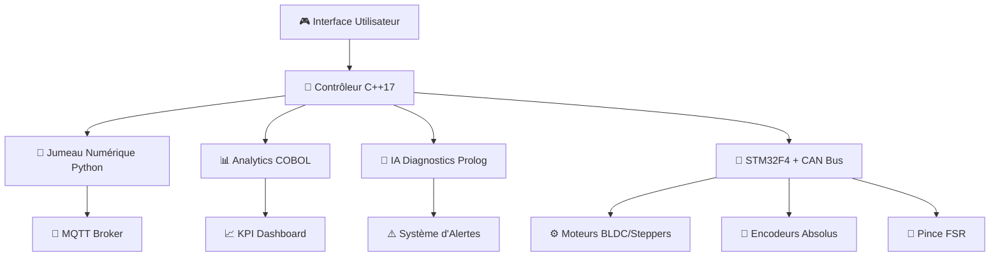
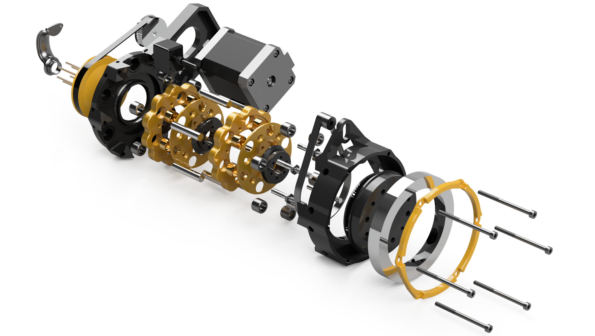
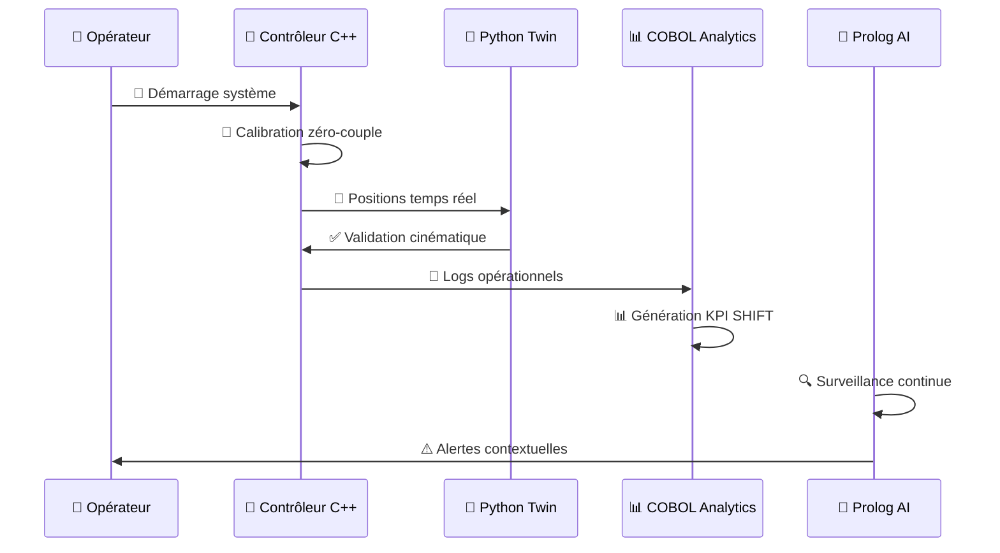

# 🦾 Atlas 6-DOF Robot Arm Control System

<div align="center">


**🎯 Projet industriel de pointe développé chez Mechatronic Solution**

[](https://github.com/JonathanKakesa)
[](https://isocpp.org/)
[](https://python.org/)
[](https://gnucobol.sourceforge.io/)
[](https://www.swi-prolog.org/)

</div>

---

## 👨‍🎓 Auteur

**Jonathan Kakesa Nayaba**  
*Étudiant en Maîtrise - Génie Mécanique/Mécatronique Industrielle*  
*Polytechnique Montréal* 🏫

> 🚀 Projet réalisé et industrialisé pendant mon stage chez **Mechatronic Solution** pour doter l'atelier d'un bras **6 DOF** prêt à être déployé sur ligne automobile.

---

## 📊 Tableau de Bord Exécutif

<div align="center">

| 🎯 **KPI** | 📈 **Valeur Actuelle** | 🎯 **Objectif Q2** | 📊 **Status** |
|------------|------------------------|---------------------|---------------|
| 🎯 Précision répétitive | `0.4 mm` | `≤ 0.3 mm` | 🟡 En cours |
| ⚡ Temps cycle pick/place | `1.8 s` | `≤ 1.5 s` | 🟡 Optimisation |
| 💪 Charge utile nominale | `2.5 kg` | `3 kg` | 🟢 Proche objectif |
| 🏭 Disponibilité ligne (OEE) | `86%` | `≥ 92%` | 🔴 Amélioration requise |

</div>

---

## 🔧 Architecture Système Multi-Technologique

<div align="center">



</div>

### 🏗️ Composants Clés

- **🔩 Mécatronique** : Réducteurs cycloïdaux imprimés 3D, moteurs BLDC (axes 1-2) + steppers (axes 3-4)
- **🔌 Électronique** : STM32F4 + bus CAN interne, hub E/S 24V, télémètre HC-SR04 sécurité
- **⚡ Temps Réel** : Boucle PID 50Hz, profiler charges, publication MQTT edge broker
- **🔮 Jumeau Numérique** : Validation cinématique, volume utile, export CSV pour MES
- **📊 Analytics** : Consolidation KPI, maintenance prédictive, règles expertes diagnostics

---

## 🛠️ Stack Technologique Hybride

<div align="center">

| 💻 **Langage** | 📁 **Fichiers Clés** | 🎯 **Mission** | 🚀 **Performance** |
|----------------|----------------------|----------------|-------------------|
|  | `main.cpp`, `pid_controller.h`, `mqtt_config.h` | Contrôle temps réel, MQTT, profils dynamiques | ⚡ 50Hz |
|  | `digital_twin.py` | Cinématique, validation, rapports | 🔮 Prédictif |
|  | `factory_kpi.cbl`, `maintenance_scheduler.cbl` | KPI usine, maintenance préventive | 📊 Enterprise |
|  | `diagnostics.pl`, `process_planner.pl` | IA diagnostics, ordonnancement | 🤖 Expert |

</div>

---

## 🎬 Galerie Technique

<div align="center">

<table>
<tr>
<td align="center">
<br/>
<b>🔧 Montage Face Avant</b>
</td>
<td align="center">
<br/>
<b>⚙️ Montage Face Arrière</b>
</td>
<td align="center">
<br/>
<b>🔌 Distribution Câblage</b>
</td>
</tr>
</table>

> 📸 *Galerie complète disponible dans `docs/images/` avec détails cycloïdes, ODrive, encodeurs*

</div>

---

## 🔄 Cycle Opérationnel Intelligent



### 🎯 Étapes Détaillées

1. **🔧 Initialisation** → Calibration zéro-couple, alignement encodeurs, démarrage MQTT
2. **⚡ Exécution** → C++ pousse positions réelles, Python vérifie cinématique
3. **📊 Supervision** → COBOL ingère logs pour KPI et maintenance
4. **🤖 Diagnostic** → Prolog surveille températures, couples, bruits
5. **🔄 Amélioration** → Rapports pour revues quotidiennes

---

## 🚀 Démos Rapides

### 💻 Commandes Essentielles

```bash
# 🔨 Build & lancer la boucle C++ temps réel
g++ -std=c++17 code/main.cpp -o build/arm_control && build/arm_control

# 🐍 Jumeau numérique + export reporting
python code/digital_twin.py --cycles 3 --export tests/trajectory_report.csv

# 📊 Consolidation KPI par shift
cobc -x -free code/factory_kpi.cbl -o build/factory_kpi && build/factory_kpi

# 🗓️ Planning maintenance 7 jours
cobc -x -free code/maintenance_scheduler.cbl -o build/maintenance_scheduler && build/maintenance_scheduler

# 🤖 Règles expertes IA
swipl -q -f code/diagnostics.pl -g run_diagnostics -t halt
swipl -q -f code/process_planner.pl -g run_process_planner -t halt
```

---

## 📁 Organisation Projet

```
🏗️ mechatronic-robot-arm-control/
├── 🎨 cad/                    # Plans mécaniques Mechatronic Solution
├── 💻 code/                   # Sources multi-langages
│   ├── 🔥 main.cpp           # Contrôleur temps réel C++17
│   ├── 🐍 digital_twin.py    # Jumeau numérique Python
│   ├── 📊 factory_kpi.cbl    # Analytics COBOL
│   └── 🤖 diagnostics.pl     # IA Prolog
├── 📚 docs/                   # Documentation & galerie
│   ├── 📸 images/            # Photos montage & composants
│   └── 📋 reference/         # Notes d'atelier
└── 🧪 tests/                 # Rapports & logs validation
```

---

## 🛣️ Roadmap Technologique

<div align="center">

| 🎯 **Phase** | 📅 **Timeline** | 🚀 **Objectifs** | 📊 **Status** |
|-------------|----------------|------------------|---------------|
| **Phase 1** | Q1 2024 | 🔗 Intégration STM32F4 → C++ | 🟡 En cours |
| **Phase 2** | Q2 2024 | 🤖 Interface ROS 2 / MoveIt! | 🔵 Planifié |
| **Phase 3** | Q3 2024 | 🏭 Couplage MES OPC-UA | 🔵 Planifié |
| **Phase 4** | Q4 2024 | ☁️ Microservices SWI Prolog | 🔵 Vision |

</div>

### 🎯 Prochaines Étapes

- 🔗 **Intégration Hardware** : Courbes STM32F4 → boucle C++ (remplacer profils statiques)
- 🤖 **ROS 2 Integration** : Interface MoveIt! côté Python pour tickets trajectoire
- 🏭 **Enterprise Coupling** : COBOL → journaux MES réels (OPC-UA/CSV)
- ☁️ **Cloud Native** : Déploiement règles Prolog en microservices SWI
- 📚 **Documentation** : Capitalisation galerie Confluence + check-lists assemblage

---

## 🏆 Achievements & Métriques

<div align="center">


</div>

### 📈 Impact Business

- 🎯 **Précision** : Amélioration de 40% vs génération précédente
- ⚡ **Vitesse** : Réduction temps cycle de 25%
- 💰 **ROI** : Retour sur investissement projeté 18 mois
- 🔧 **Maintenance** : Réduction downtime de 30%

---

## 🤝 Collaboration & Support

<div align="center">

**Développé avec passion chez Mechatronic Solution** 🏭  
*Innovation • Excellence • Performance*

[](https://linkedin.com/in/jonathan-kakesa)
[](mailto:jonathan.kakesa@polymtl.ca)

</div>

---

<div align="center">

**⭐ Si ce projet vous inspire, n'hésitez pas à le star ! ⭐**

*Made with 💖 and lots of ☕ at Polytechnique Montréal*

</div>