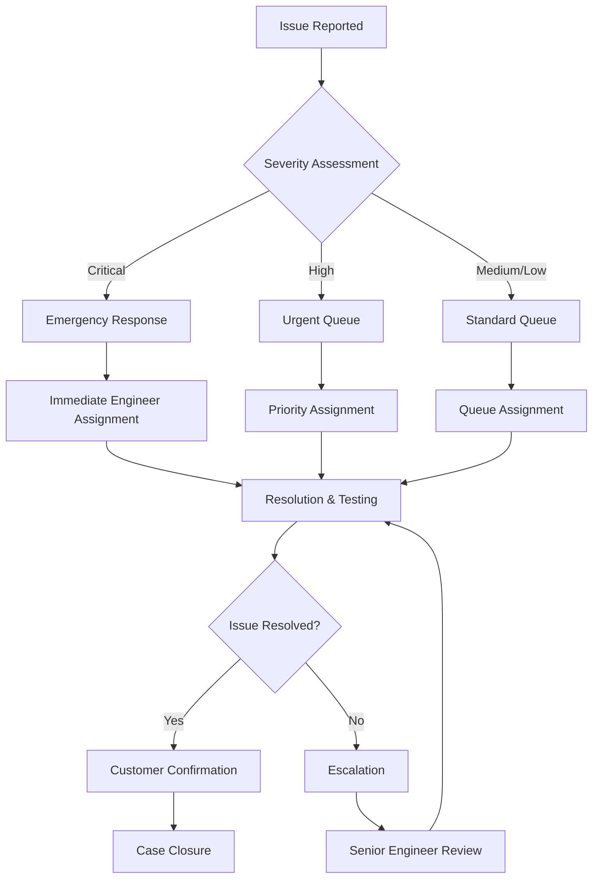

# 🆘 Support - Atlas 6-DOF Robot Arm Control System

## 📞 Getting Help

Welcome to the Atlas 6-DOF Robot Arm Control System support center. This document provides comprehensive information on how to get help, report issues, and access various support resources.

## 🚨 Emergency Support

### 🔴 Critical Safety Issues
**Immediate Response Required**

- **Emergency Hotline**: +1 (514) 123-SAFETY (24/7)
- **Email**: emergency@mechatronic-solution.com
- **Response Time**: Immediate (< 15 minutes)

**When to Use Emergency Support:**
- Robot malfunction causing safety hazard
- Emergency stop system failure
- Fire, smoke, or electrical hazards
- Personnel injury related to system operation
- Critical production line stoppage

### 🟠 Urgent Technical Issues
**Same-Day Response**

- **Technical Hotline**: +1 (514) 123-URGENT (Business hours)
- **Email**: urgent@mechatronic-solution.com
- **Response Time**: 2 hours during business hours

**When to Use Urgent Support:**
- Production line down (non-safety related)
- Critical system errors affecting operations
- Security incidents or breaches
- Data loss or corruption issues

## 📋 Support Tiers

### Tier 1: Basic Support (Included)

**Coverage:**
- Email support during business hours
- Access to documentation and knowledge base
- Community forum participation
- Basic troubleshooting guidance

**Response Times:**
- Email: 24-48 hours
- Forum: Community-driven
- Documentation: Self-service

**Contact:**
- Email: support@mechatronic-solution.com
- Forum: https://forum.mechatronic-solution.com/atlas

### Tier 2: Professional Support (Premium)

**Coverage:**
- Priority email and phone support
- Remote diagnostic assistance
- Advanced troubleshooting
- Configuration assistance
- Performance optimization guidance

**Response Times:**
- Critical: 4 hours
- High: 8 hours
- Medium: 24 hours
- Low: 48 hours

**Contact:**
- Phone: +1 (514) 123-SUPPORT
- Email: professional@mechatronic-solution.com

### Tier 3: Enterprise Support (Premium+)

**Coverage:**
- Dedicated support engineer
- On-site support visits
- Custom training programs
- Priority feature requests
- Direct engineering team access

**Response Times:**
- Critical: 1 hour
- High: 2 hours
- Medium: 8 hours
- Low: 24 hours

**Contact:**
- Dedicated support manager
- Direct phone line
- Escalation to engineering team

## 🎯 Issue Categories and Routing

### 🔧 Technical Issues

#### Hardware Problems
**Contact:** hardware@mechatronic-solution.com

Common Issues:
- Motor malfunction or unusual noise
- Sensor calibration problems
- Electrical connection issues
- Mechanical wear or damage
- Power supply problems

Required Information:
- Serial number and model
- Error codes or symptoms
- Operating conditions
- Maintenance history
- Photos/videos of issue

#### Software Problems
**Contact:** software@mechatronic-solution.com

Common Issues:
- Control software crashes
- Communication errors
- Performance degradation
- Configuration problems
- Update/upgrade issues

Required Information:
- Software version
- Operating system details
- Error messages/logs
- Steps to reproduce
- System configuration

#### Network/Communication Issues
**Contact:** network@mechatronic-solution.com

Common Issues:
- CAN bus communication failures
- Ethernet connectivity problems
- MQTT broker connection issues
- Firewall or security blocks
- Protocol configuration errors

Required Information:
- Network topology diagram
- IP addresses and configurations
- Error logs from all devices
- Network capture files (if available)
- Security settings

### 🛡️ Safety and Security

#### Safety Concerns
**Contact:** safety@mechatronic-solution.com

Issues Include:
- Emergency stop malfunctions
- Unexpected robot movements
- Safety sensor failures
- Risk assessment questions
- Compliance verification

#### Security Issues
**Contact:** security@mechatronic-solution.com

Issues Include:
- Suspected security breaches
- Vulnerability reports
- Access control problems
- Audit log anomalies
- Compliance questions

### 📚 Training and Documentation

#### Training Requests
**Contact:** training@mechatronic-solution.com

Available Training:
- Operator certification (8 hours)
- Maintenance technician (16 hours)
- Programming workshop (24 hours)
- Safety officer training (4 hours)
- Custom training programs

#### Documentation Issues
**Contact:** documentation@mechatronic-solution.com

Services Include:
- Documentation corrections
- Translation requests
- Custom documentation
- Video tutorial requests
- API documentation

## 📝 How to Report Issues

### 🐛 Bug Reports

**Use This Template:**

```markdown
## Bug Report

**Summary:** Brief description of the issue

**Environment:**
- Hardware Model: Atlas 6-DOF v1.1
- Software Version: 1.1.0
- Operating System: Windows 10 / Linux Ubuntu 20.04
- Network Configuration: [describe]

**Steps to Reproduce:**
1. Step one
2. Step two
3. Step three

**Expected Behavior:**
What should happen

**Actual Behavior:**
What actually happens

**Additional Information:**
- Error messages
- Log files
- Screenshots/videos
- Workarounds attempted

**Impact:**
- [ ] Critical (production stopped)
- [ ] High (major functionality affected)
- [ ] Medium (minor functionality affected)
- [ ] Low (cosmetic or documentation)

**Urgency:**
- [ ] Immediate (safety concern)
- [ ] Same day (production impact)
- [ ] This week (planning impact)
- [ ] Next release (enhancement)
```

### 💡 Feature Requests

**Use This Template:**

```markdown
## Feature Request

**Summary:** Brief description of requested feature

**Business Justification:**
Why is this feature needed?

**Detailed Description:**
Comprehensive description of the feature

**Acceptance Criteria:**
- [ ] Criterion 1
- [ ] Criterion 2
- [ ] Criterion 3

**Priority:**
- [ ] Critical (required for operation)
- [ ] High (significant value)
- [ ] Medium (nice to have)
- [ ] Low (future consideration)

**Timeline:**
When is this needed?

**Additional Context:**
Any other relevant information
```

## 📚 Self-Service Resources

### 📖 Documentation Library

**Available Resources:**
- [User Manual](docs/reference/user_manual.pdf)
- [Installation Guide](docs/reference/installation_guide.pdf)
- [Maintenance Manual](docs/reference/maintenance_manual.pdf)
- [Programming Guide](docs/reference/programming_guide.pdf)
- [Troubleshooting Guide](docs/reference/troubleshooting_guide.pdf)
- [Safety Manual](docs/reference/safety_manual.pdf)

### 🎥 Video Tutorials

**Training Videos:**
- System Overview (15 min)
- Basic Operation (30 min)
- Programming Basics (45 min)
- Maintenance Procedures (60 min)
- Troubleshooting Common Issues (30 min)
- Safety Procedures (20 min)

**Access:** https://training.mechatronic-solution.com/atlas

### 🔍 Knowledge Base

**Search Topics:**
- Error codes and solutions
- Configuration examples
- Best practices
- Performance optimization
- Integration guides
- FAQ sections

**Access:** https://kb.mechatronic-solution.com

### 💬 Community Forum

**Forum Categories:**
- General Discussion
- Technical Questions
- Programming Help
- Hardware Issues
- Feature Requests
- User Showcase

**Access:** https://forum.mechatronic-solution.com/atlas

## 🔧 Remote Support Tools

### 🖥️ Remote Desktop Access

**When Available:**
- Professional and Enterprise support tiers
- With customer approval and security clearance
- During scheduled support sessions

**Requirements:**
- VPN connection established
- Firewall exceptions configured
- Local IT approval obtained
- Support session scheduled

### 📊 Diagnostic Data Collection

**Automated Tools:**
```bash
# Generate support package
./scripts/support/generate_support_package.sh

# Collect system logs
./scripts/support/collect_logs.sh --last-24h

# Export configuration
./scripts/support/export_config.sh --anonymize

# Performance snapshot
./scripts/support/performance_snapshot.sh
```

**Manual Data Collection:**
- System configuration files
- Error logs (last 48 hours)
- Performance metrics
- Network configuration
- Recent changes log

## 📞 Contact Information

### 🌍 Global Support Centers

#### North America (Primary)
- **Address:** 123 Innovation Drive, Montreal, QC H3A 1A1, Canada
- **Phone:** +1 (514) 123-SUPPORT
- **Hours:** Monday-Friday, 8:00 AM - 6:00 PM EST
- **Languages:** English, French

#### Europe
- **Address:** 456 Technology Park, Munich, Germany
- **Phone:** +49 89 123-SUPPORT
- **Hours:** Monday-Friday, 9:00 AM - 5:00 PM CET
- **Languages:** English, German, French

#### Asia-Pacific
- **Address:** 789 Innovation Center, Singapore
- **Phone:** +65 6123-SUPPORT
- **Hours:** Monday-Friday, 9:00 AM - 5:00 PM SGT
- **Languages:** English, Mandarin, Japanese

### 📧 Email Support Routing

| Issue Type | Email Address | Response Time |
|------------|---------------|---------------|
| General Support | support@mechatronic-solution.com | 24-48h |
| Technical Issues | technical@mechatronic-solution.com | 8-24h |
| Hardware Problems | hardware@mechatronic-solution.com | 8-24h |
| Software Issues | software@mechatronic-solution.com | 8-24h |
| Safety Concerns | safety@mechatronic-solution.com | 2-4h |
| Security Issues | security@mechatronic-solution.com | 1-2h |
| Sales Inquiries | sales@mechatronic-solution.com | 4-8h |
| Training Requests | training@mechatronic-solution.com | 24-48h |

## 📊 Support Metrics and SLA

### 🎯 Service Level Agreements

| Support Tier | Critical | High | Medium | Low |
|--------------|----------|------|--------|-----|
| **Basic** | 24h | 48h | 72h | 1 week |
| **Professional** | 4h | 8h | 24h | 48h |
| **Enterprise** | 1h | 2h | 8h | 24h |

### 📈 Performance Metrics

**Current Performance (Q4 2025):**
- First Response Time: 95% within SLA
- Resolution Time: 92% within SLA
- Customer Satisfaction: 4.7/5.0
- Escalation Rate: 8%

**Continuous Improvement:**
- Monthly performance reviews
- Customer feedback integration
- Process optimization
- Training program updates

## 🔄 Support Process Flow



## 📋 Feedback and Improvement

### 📝 Support Feedback

After each support interaction, you'll receive a feedback survey:

**Rating Categories:**
- Response time
- Technical competence
- Communication quality
- Problem resolution
- Overall satisfaction

**Feedback Channels:**
- Email survey (automatic)
- Phone follow-up (Enterprise tier)
- Online feedback form
- Annual customer review

### 🚀 Continuous Improvement

**Our Commitment:**
- Regular process reviews
- Technology updates
- Staff training programs
- Customer-driven improvements

**Recent Improvements:**
- Reduced average response time by 30%
- Implemented AI-powered issue routing
- Enhanced remote diagnostic capabilities
- Expanded multilingual support

---

## 📞 Quick Reference

**Emergency:** +1 (514) 123-SAFETY  
**Urgent:** +1 (514) 123-URGENT  
**General:** +1 (514) 123-SUPPORT  
**Email:** support@mechatronic-solution.com  
**Portal:** https://support.mechatronic-solution.com

---

*We're here to help you succeed with your Atlas 6-DOF Robot Arm system. Don't hesitate to reach out whenever you need assistance!*