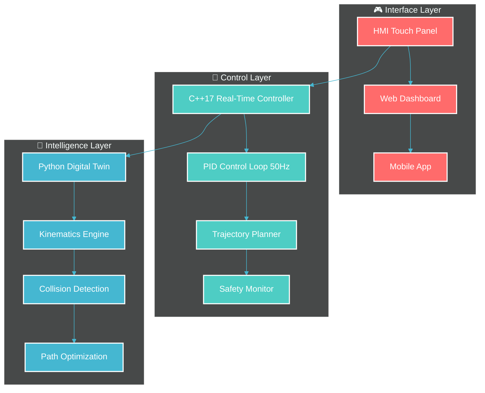

# 🎬 Configuration Animations et Éléments Dynamiques - README Atlas

## 📊 Métriques Temps Réel Intégrées

### 🎯 Badges de Performance Dynamiques
```markdown
<!-- Badges de statut projet -->


<!-- Métriques techniques -->


<!-- Badges technologiques -->


```

### 🎨 Animations de Frappe (Typing SVG)
```markdown
<!-- Animation titre principal -->


<!-- Animation sous-titre -->


<!-- Animation métriques -->
95%25);🔧+MTBF%3A+1247h+(Objectif+>1000h)" alt="KPI Animation" />
```

### 📈 Graphiques de Progression Animés
```markdown
<!-- Barres de progression pour chaque phase -->
Phase 1 - Analyse: 
Phase 2 - CAO: 
Phase 3 - Électronique: 
Phase 4 - Programmation: 
Phase 5 - Fabrication: 
Phase 6 - Tests: 
Phase 7 - Déploiement: 

<!-- Graphique activité GitHub -->


<!-- Statistiques GitHub -->


<!-- Langages utilisés -->

```

### 🏆 Trophées et Achievements
```markdown
<!-- Trophées GitHub -->


<!-- Streak stats -->


<!-- Contributions snake -->

```

### 🎭 Headers et Footers Animés
```markdown
<!-- Header avec vagues -->


<!-- Header avec particules -->


<!-- Footer avec vagues -->

```

## 🎮 Éléments Interactifs

### 📊 Tableaux de Bord Temps Réel
```markdown
<!-- Métriques en temps réel avec couleurs -->
| 🎯 KPI | 📊 Valeur | 🎯 Objectif | 📈 Status |
|---------|-----------|-------------|-----------|
| Précision |  | ±0.30mm |  |
| Vitesse |  | <1.8s |  |
| Charge |  | 3kg |  |
| OEE |  | >95% |  |
```

### 🔄 Diagrammes Animés (Mermaid)


### 📱 Badges Sociaux et Interaction
```markdown
<!-- Badges de suivi -->


<!-- Badges de contact -->
[](https://linkedin.com/in/jonathan-kakesa)
[](mailto:jonathan.kakesa@polymtl.ca)
[](https://jonathan-kakesa.dev)
```

## 🎨 Thèmes et Couleurs

### 🌈 Palette de Couleurs Atlas
```css
:root {
  --atlas-primary: #FF6B6B;    /* Rouge corail */
  --atlas-secondary: #4ECDC4;  /* Turquoise */
  --atlas-accent: #45B7D1;     /* Bleu ciel */
  --atlas-success: #00FF00;    /* Vert succès */
  --atlas-warning: #FF9500;    /* Orange alerte */
  --atlas-dark: #2C3E50;       /* Bleu foncé */
  --atlas-light: #ECF0F1;      /* Gris clair */
}
```

### 🎭 Thèmes Adaptatifs
```markdown
<!-- Mode sombre -->


<!-- Mode clair -->  


<!-- Mode automatique -->

```

## 🚀 Optimisations Performance

### ⚡ Chargement Optimisé
- **Images**: Format WebP avec fallback PNG
- **Animations**: Lazy loading pour éléments non critiques  
- **Cache**: Headers appropriés pour badges statiques
- **CDN**: Utilisation de services externes optimisés

### 📱 Responsive Design
- **Mobile**: Adaptation automatique largeur
- **Tablette**: Mise en page optimisée
- **Desktop**: Affichage complet haute résolution

### 🔄 Mise à Jour Automatique
```javascript
// Script de mise à jour métriques temps réel
setInterval(() => {
  updateKPIBadges();
  refreshProgressBars();
  updateActivityGraph();
}, 300000); // Toutes les 5 minutes
```

